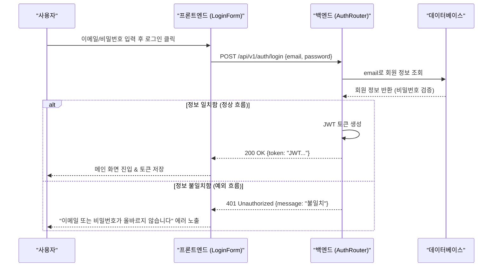
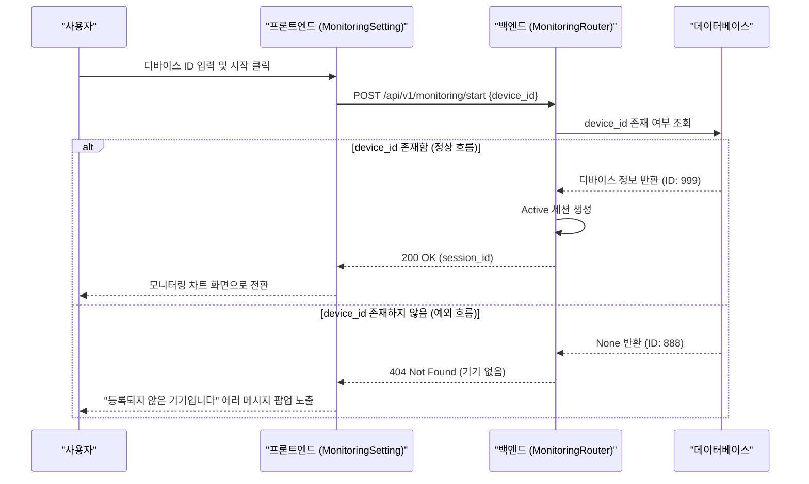

# 📖 ATDD (Acceptance Test-Driven Development) 가이드

이 문서는 **ATDD(인수 테스트 주도 개발)**의 개념을 쉽게 이해하고, 우리 프로젝트의 BDD-TDD 개발 프로세스에 어떻게 융합되어 실천되는지 설명하는 가이드라인입니다.

---

## 1. ATDD란 무엇인가요?

**ATDD (Acceptance Test-Driven Development, 인수 테스트 주도 개발)**는 개발을 시작하기 전에 **"무엇을 만들 것인가(요구사항)"**에 대한 기준인 **인수 테스트(Acceptance Test)**를 먼저 정의하고, 이 테스트를 통과시키는 것을 목표로 개발을 진행하는 방법론입니다.

### 💡 TDD vs ATDD 비교

| 구분 | TDD (테스트 주도 개발) | ATDD (인수 테스트 주도 개발) |
| :--- | :--- | :--- |
| **주요 질문** | "코드를 올바르게 작성하고 있는가?" (Is it built right?) | "올바른 기능을 만들고 있는가?" (Is it the right thing?) |
| **관점** | 개발자 관점 (Unit/클래스/함수 수준의 기술적 검증) | 사용자 및 비즈니스 관점 (기능 요구사항 만족 여부 검증) |
| **작성 시점** | 코드를 구현하기 직전 (Red-Green-Refactor) | 기획 단계 및 개발 설계 시작 시점 |
| **검증 주체** | 단위 테스트 코드 (Vitest, pytest 등) | 기획서(RTM), 유저플로우, BDD 시나리오 |

> TDD가 자동차의 **엔진 나사(단위 코드)**가 견고하게 조여졌는지 확인하는 작업이라면,  
> ATDD는 완성된 자동차가 사용자가 원하는대로 **전진하고, 회전하고, 멈추는지(비즈니스 요구사항)** 확인하는 작업입니다.

### 🔄 우리 프로젝트에서의 ATDD와 TDD 용어 분리 원칙

업계나 실무에서는 종종 두 용어가 혼용되어 사용되기도 하나, **우리 프로젝트에서는 설계와 구현의 명확성을 위해 ATDD와 TDD를 엄밀히 구분하여 사용합니다.** 두 개념이 모호하게 섞일 경우 각각의 검증 대상과 역할이 헷갈려 구현 누락이 발생할 수 있기 때문입니다.


두 개념은 다음과 같이 명확한 경계(Boundary)를 가지고 분리되어 동작합니다.

| 비교 항목 | ATDD (Acceptance Test-Driven) | TDD (Test-Driven) |
| :--- | :--- | :--- |
| **개념 정의** | **비즈니스 인수 조건(기획 합격선) 중심** 개발 방법론 | **소스코드 구현 신뢰성(단위 테스트) 중심** 개발 방법론 |
| **질문과 목적** | "기획서가 요구한 올바른 비즈니스 기능을 만들었는가?" | "개별 코드(함수/클래스)를 버그 없이 정밀하게 짰는가?" |
| **주요 대상** | 에픽(Epic), 유저 스토리, 인수 조건(AC), 유저플로우 | 개별 클래스, 컴포넌트 내부 로직, 유틸리티 함수 |
| **참여 주체** | 기획자(PO), 개발자, QA (비즈니스 협업 그룹) | 개발자 단독 (순수 기술적 구현 그룹) |
| **사용 도구** | 마스터 RTM, 유저플로우 시퀀스 다이어그램 | Vitest, pytest, Jest 등 단위 테스트 프레임워크 |

### 🚫 오해 방지를 위한 세부 경계 규칙

1.  **ATDD는 TDD를 포함하지 않습니다**: 
    - ATDD는 요구사항 설계와 최종 인수 조건이 맞물려 있는지를 검증하는 **'설계 및 인수 통제 기법'**입니다. 내부 코드가 TDD(단위 테스트 선작성) 방식으로 짜였는지 여부는 ATDD의 관심사가 아닙니다.
2.  **TDD는 비즈니스 인수를 보장하지 않습니다**:
    - TDD는 소스코드 내부의 개별 모듈이 기술적으로 결함 없이 작동하는지 검증하는 **'코딩 기법'**입니다. TDD로 작성된 모든 단위 테스트가 통과해도, 기획자가 요구한 원래 비즈니스 흐름(인수 조건)과 불일치할 수 있습니다.
3.  **수행 시점의 물리적 분리**:
    - **ATDD 단계**: 코드를 짜기 전 설계 단계에서 RTM을 작성하고 유저플로우(`_flow.md`)와 시나리오(`.feature`)를 확정하는 단계입니다.
    - **TDD 단계**: 설계 승인 이후, 프로덕션 코드를 실제로 코딩하면서 단위 테스트 코드(`*.test.ts`)와 프로덕션 코드를 반복 작성하는 구현 단계입니다.

---


## 2. BDD와 ATDD의 시나리오 작업 방식 (프로세스) 결정적 차이

"시나리오 내용 자체는 Given-When-Then으로 똑같은데 무엇이 다르다는 건가?"라는 의문이 드는 것은 당연합니다. **핵심은 시나리오를 작성하고 검증하는 '작업 프로세스(Workflow)와 목적'의 차이**에 있습니다.

```
[일반 BDD 시나리오 워크플로우 (개발자의 사후 테스트 도구)]
기획서 전달 ──> 개발자가 혼자 머릿속으로 상상 ──> BDD 시나리오 작성 ──> TDD 구현
(기획 누락 검증 불가능, API 정합성 검증 불가, 단순히 '말이 통하는 테스트 코드' 수준)

[ATDD 시나리오 워크플로우 (팀 전체의 선제적 설계 계약서)]
기획 요구사항 식별 ──> 유저플로우 시퀀스 설계(API/분기 확정) ──> 시나리오(Given-When-Then) 변환 ──> RTM 매핑 계약
(100% 기획 검증, API 정합성 확보, 물리적 소스코드 존재 입증, 기획/QA/에이전트가 공유하는 인수 관문)
```

두 방식의 구체적인 작업 방식 차이는 다음과 같습니다.

### ① 시나리오 작성의 주체와 목적
*   **일반 BDD**: 
    - **누가**: 주로 **개발자나 QA가 단독**으로 작성합니다.
    - **목적**: 기획서 분석이 끝나고 코딩을 편하게 하기 위한 **'테스트 코드의 주석 및 명세서'** 역할을 합니다.
*   **ATDD**: 
    - **누가**: 기획자(PO), 개발자, QA(또는 AI 에이전트)가 **협력하여 공동**으로 도출합니다.
    - **목적**: 개발을 시작하기 전에 이 조건이 충족되면 기획이 완성된 것으로 인정한다는 **'비즈니스 계약서(인수 관문)'** 역할을 합니다.

### ② 시나리오 도출의 기준점
*   **일반 BDD**: 
    - 기획서의 줄글 요구사항을 보고 개발자가 자신의 주관에 따라 시나리오를 만들어 냅니다. 시스템 레이어의 분기나 데이터의 흐름을 엄밀히 따지지 않기 때문에 해피 패스 위주로 흘러가기 쉽습니다.
*   **ATDD**: 
    - **유저플로우 시퀀스 다이어그램**을 먼저 설계하여 프론트엔드와 백엔드 간의 API 요청, 데이터베이스 조회, 비즈니스 로직 분기(alt/else)를 시각적으로 먼저 뽑아냅니다.
    - 이 다이어그램의 **물리적인 흐름 선들과 예외 분기점들을 그대로 Given-When-Then 문장으로 변환**하여 시나리오를 도출합니다. 즉, 시나리오의 뼈대가 주관이 아닌 **시스템 구조적 인과관계**에 의해 도출됩니다.

### ③ 추적성과 감사(Audit) 장치
*   **일반 BDD**: 
    - `.feature` 파일과 프로덕션 코드는 따로 놉니다. 기획 요구사항이 변경되어도 시나리오가 업데이트되었는지 강제할 방법이 없으며, 시나리오가 전체 요구사항을 커버하는지 검증하는 도구가 없습니다.
*   **ATDD**: 
    - **RTM(요구사항 추적 매트릭스)**에 `[기획 요구사항 - 유저플로우 - BDD 시나리오 - 실제 소스코드 파일]`을 일련번호(S01, S02 등)로 엮어 매핑합니다.
    - 구현이 완료되면 `rtm-evaluator.py`를 돌려 RTM 매트릭스에 기입된 소스코드와 테스트 뼈대가 100% 일치하고 실제 검증 증거가 준비되었는지 **자동으로 감사(Audit)**합니다. 검증되지 않은 시나리오가 있으면 빌드/배포 게이트를 통과할 수 없습니다.

> **요약하자면**:  
> BDD 시나리오는 단순히 **"문장을 예쁘게 쓰는 코딩용 명세"**이고,  
> ATDD 시나리오는 **"유저플로우로 설계 분기를 먼저 쪼갠 뒤 문장화하고, RTM에 매핑하여 인수 완료 여부를 최종 추적하는 비즈니스 통제 도구"**입니다.


---

## 3. ATDD는 어떻게 시나리오의 완성도를 보장하나요? (BDD와의 결정적 차이)

일반 BDD에서는 개발자가 생각나는 대로 Given-When-Then을 몇 개 적고 끝냅니다. 이 방식은 **"시나리오 자체가 누락되었거나 부실한 문제(품질 저하)"**를 예방할 수 없습니다. 

ATDD는 다음의 **3가지 안전장치**를 통해 시나리오의 완성도와 커버리지를 보장합니다.

```
┌────────────────────────────────────────────────────────────────────────┐
│                        ATDD 시나리오 완성도 보장 장치                  │
├──────────────────────────┬────────────────────────┬────────────────────┤
│ 1. 시나리오 패턴 다각화  │ 2. 3-Amigos 교차 검토  │ 3. 아키텍처 맵 검증│
│ (Happy/Boundary/Error)   │ (기획/개발/QA 관점)    │ (코드 구조 일치성) │
└──────────────────────────┴────────────────────────┴────────────────────┘
```

### ① 시나리오 분류의 강제화 (정상/임계치/예외 흐름 분리)
ATDD는 RTM 매트릭스 설계 시, 하나의 요구사항에 대해 최소한 다음 3가지 유형의 시나리오가 모두 도출되었는지 검증합니다.
*   **정상 흐름 (Happy Path)**: 사용자가 의도한 일반적인 성공 시나리오.
*   **임계값/경계선 흐름 (Boundary Path)**: 시스템이 오작동하기 쉬운 한계값 조건 (예: 입력값 0, 음수, 최대 글자수 초과 등).
*   **예외/에러 흐름 (Exception Path)**: 네트워크 단절, 중복 요청, 권한 오류 등 장애 상황에서의 복구 시나리오.
*   *RTM 테이블에 정상 흐름만 기재되어 있고 경계선/예외 흐름 행(Row)이 비어 있다면, 기획 설계 단계에서 '미완성 시나리오'로 판단하여 승인 게이트를 통과할 수 없습니다.*

### ② 3-Amigos의 예시 매핑 (Example Mapping)을 통한 구체화
ATDD는 기획자(비즈니스), 개발자(기술), QA/테스터(품질)의 세 관점(Three Amigos)이 한 자리에 모여 **구체적인 데이터 예시**를 들며 시나리오를 검토합니다.
*   **추상적 BDD**: "사용자가 나이를 입력하면 성인 인증을 한다." (경계선이 모호함)
*   **ATDD 구체화 (Example Mapping)**:
    - 예시 1: 입력값 `18` ➡️ 성인 인증 실패 (임계값 미만)
    - 예시 2: 입력값 `19` ➡️ 성인 인증 성공 (임계값 기준점)
    - 예시 3: 입력값 `abc` ➡️ 포맷 에러 메시지 노출 (예외 흐름)
    - *이 검토 과정을 통해 모호한 기획이 명확한 테스트 케이스로 변환됩니다.*

### ③ 아키텍처 매핑 매트릭스를 통한 구조적 역검증
RTM 테이블 내의 행(시나리오)과 열(소스코드 레이어: Router, Service, VO, Exception 등)의 관계를 분석하여 시나리오의 완성도를 교차 검증합니다.
*   **매핑 교차 검증**:
    - 만약 기획에는 "비정상 로그인 시도 제한"이라는 중요한 인수 조건이 있는데, RTM 매트릭스 상에 이에 대응하는 `BE-DOMAIN-EXCEPTION` 이나 `BE-DOMAIN-SERVICE` 소스코드 파일이 매핑되어 있지 않다면? ➡️ **구현 누락 발견.**
    - 반대로, 소스코드에는 `test_withdrawal.py` (회원 탈퇴 테스트) 파일이 구현되어 있는데, 정작 RTM 시나리오나 BDD 거킨 문서에는 회원 탈퇴 관련 흐름이 정의되어 있지 않다면? ➡️ **BDD 설계 누락 발견.**
    - *이처럼 RTM의 행-열 관계가 거울처럼 매핑되어 있어, 설계가 누락되었는지 코드가 오버스펙(Over-engineering)인지 즉각 감지해 냅니다.*

---

## 4. ATDD에서의 시나리오 작성 상세 과정 (유저플로우와 시나리오의 탄생)

기존에 작성하신 유저플로우(`*_flow.md`) 및 에이전트 환류 루프는 바로 이 **ATDD 시나리오 설계 프로세스**에서 도출된 결과물입니다. ATDD에서 고품질 시나리오가 완성되는 상세 과정은 다음과 같습니다.

### 1단계: 비정형 요구사항의 구조화 및 에픽(Epic) 등록
*   비정형 텍스트 기획안이 접수되면 이를 단일 목적을 가진 에픽 단위로 분류하고 마스터 RTM의 첫 테이블에 `🔴 TODO` 상태로 등록합니다.

### 2단계: 에픽 분할 (Epic Slicing) 및 유저 스토리 도출
*   하나의 큰 에픽을 개발이 가능한 수준의 여러 **유저 스토리**로 분할합니다.
*   각 유저 스토리는 작성 단계에서부터 올바른 설계인지 보장하기 위해 **INVEST 기준**을 준수해야 합니다:
    > **💡 좋은 시나리오/스토리의 6대 기준 (INVEST)**
    > *   **I**ndependent (독립성): 다른 스토리와 얽히지 않고 독립적으로 개발 및 테스트가 가능해야 합니다.
    > *   **N**egotiable (협상 가능성): 세부 구현 방식은 고정불변이 아니라 기획자와 조율이 가능해야 합니다.
    > *   **V**aluable (가치 있음): 사용자나 비즈니스에 확실한 유용성을 제공해야 합니다.
    > *   **E**stimable (추정 가능성): 작업 범위가 명확하여 개발 공수를 가늠할 수 있어야 합니다.
    > *   **S**mall (적절한 크기): 한 번에 하나씩 가볍게 구현할 수 있을 정도로 작아야 합니다 (비대하지 않음).
    > *   **T**estable (테스트 가능성): 성공과 실패 여부를 명확히 테스트로 증명할 수 있어야 합니다.


### 3단계: 유저플로우 시퀀스 설계 (`_flow.md` 탄생)
*   도출된 스토리별로 사용자, 프론트엔드, 백엔드 API, DB 등 **시스템 컴포넌트 간 상호작용 흐름(Sequence)**을 다이어그램으로 명시적으로 시각화합니다.
*   이 과정에서 **API 호출의 선후 관계, 데이터의 가공 주체, 예외 발생 지점**이 구조적으로 정밀하게 설계됩니다.

### 4단계: BDD 거킨 시나리오 기술 (`.feature` 탄생)
*   3단계에서 작성한 유저플로우 시퀀스의 모든 분기(정상 흐름 및 예외 지점)를 자연어 형태인 **Given-When-Then** 문장으로 1:1 변환합니다.
    - *예: 유저플로우에서 "백엔드가 401 Unauthorized 반환"하는 시퀀스 분기 ➡️ BDD에서 `Then 시스템은 인증 에러 메시지를 노출해야 한다` 시나리오로 변환.*
*   이로써 개발자와 기획자가 합의한 구체적이고 실행 가능한 **인수 시나리오**가 완성됩니다.

### 5단계: 품질 자가 복구 루프 (Self-Healing Loops) 작동
시나리오를 완성하는 과정에서 발견되는 갭이나 구조적 문제는 3가지 복구 루프를 통해 자동으로 지속 보완됩니다.
1.  **품질 실패 복구 루프 (`🟡 PENDING` ➡️ 재작성)**:
    - 작성된 시나리오가 INVEST 기준에 부합하지 않거나 테스트 불가능할 경우 `🟡 PENDING` 처리되며, 사람이 시나리오의 인수 조건을 보강하여 다시 제출하면 검증이 재실행됩니다.
2.  **기획-구현 갭 보완 루프 (`🟡 REVIEW_REQUIRED` ➡️ 정합성 보완)**:
    - 사후 감사 시 기획 요구사항(Epic)과 실제 작성된 BDD 시나리오 간 의미론적 갭이 감지되면 `🟡 REVIEW_REQUIRED` 상태가 되며, 누락된 스토리를 보강하여 갭을 메우면 최종 완료(`🟢 DONE`)로 격상됩니다.
3.  **구조 훼손 자동 리셋 루프 (`🔴 TODO` 강제 리셋)**:
    - 매트릭스 표 포맷이 손상되거나 구조가 파손되면 해당 에픽을 즉시 `🔴 TODO`로 강제 리셋하고 처음부터 깨끗하게 분할 단계를 다시 밟아 복구합니다.

### ❓ 질문: 유저플로우(`_flow.md`)가 먼저인가요, BDD 시나리오(`.feature`)가 먼저인가요?

**결론부터 말씀드리면, "유저플로우(시퀀스 구상)가 먼저"이고 그 다음이 "BDD 시나리오 구체화"입니다.**

실제 업무 및 설계 사고의 흐름은 다음과 같습니다.
1.  **유저플로우 대강 그리기 (시각적 흐름 파악)**:
    - 머릿속으로 "사용자가 화면에서 시작하면 API가 날아가고 DB를 뒤지겠지?"라는 흐름을 Mermaid 시퀀스 다이어그램(`_flow.md`)으로 먼저 그려봅니다.
    - 그림을 그리다 보면 자연스럽게 **"어? 여기서 DB에 기기가 없으면 어떻게 되지?"**라는 예외 분기(alt/else)가 시각적으로 눈에 들어오게 됩니다.
2.  **BDD 시나리오 상세 기술 (Given-When-Then 문장화)**:
    - 유저플로우 시퀀스로 전체 상호작용의 줄기(정상/예외 분기들)를 확보한 뒤, 각 분기를 **Given-When-Then 자연어 문장(`.feature`)**으로 명확하게 바꿉니다.
    - 시퀀스의 각 화살표와 조건 분기가 BDD 시나리오의 한 줄 한 줄(Step)로 대응되므로, 시나리오를 작성할 때 절대 헷갈리지 않고 누락 없이 적을 수 있습니다.

> 만약 유저플로우 없이 BDD 시나리오부터 줄글로 적으려고 하면, 머릿속으로 보이지 않는 API 통신과 예외 상황들을 상상하며 텍스트를 적어야 하므로 **시나리오의 세부 동작 조건이 부실해지거나 복잡한 예외 케이스를 빠뜨릴 위험**이 비약적으로 높아집니다.
> 
> 따라서 **[유저플로우(시퀀스) 설계 ➡️ BDD 시나리오(Given-When-Then) 기술]** 순서로 사고하는 것이 가장 완성도 높은 인수 테스트를 만드는 핵심 지름길입니다.

---

## 5. 우리 프로젝트에서의 ATDD 실천 6단계

우리는 마스터 RTM(`rtm_*.md`)과 기존 도구들을 활용하여 아주 명확한 단계로 ATDD를 실천합니다.

```
[1단계: RTM AC 정의] ──> [2단계: 유저플로우 설계] ──> [3단계: BDD 시나리오 작성] ──> [4단계: 테스트 스텁 생성]
      │                                                                                  │
[6단계: RTM 매핑 검증] <── [5단계: TDD 기반 코드 구현] <─────────────────────────────────┘
```

### 1단계: RTM(요구사항 추적 매트릭스) & AC(인수 조건) 정의
*   **행동**: 개발하고자 하는 기능의 세부 인수 조건(Acceptance Criteria, AC)을 RTM 문서(`docs/requirements/rtm_{기능명}.md`)에 표로 정리하여 기재합니다.
*   **작성 가이드라인**:
    - **AC는 비즈니스 검증 가능성**에 맞춰 작성합니다. 모호한 단어(예: "빠르게", "직관적으로", "적절하게")를 배제하고, 정확한 조건과 수치를 명시합니다.
    - 예: "태아 심박수 모니터링 세션을 시작할 때, 입력한 디바이스 ID가 등록된 기기여야만 세션이 활성화된다."

### 2단계: 유저플로우 시퀀스 설계 (`*_flow.md` 작성)
*   **행동**: RTM에 작성한 각 인수 조건(AC)을 시스템 컴포넌트 간 흐름 설명서인 **유저플로우(`*_flow.md`)** 시퀀스 다이어그램으로 설계합니다.
*   **목적**: 프론트엔드와 백엔드 간의 API 계약 및 비즈니스 예외 조건 분기를 시각적으로 조율하여 설계 누락을 원천 차단합니다.

### 3단계: BDD 거킨 시나리오 기술 (`*.feature` 작성)
*   **행동**: 설계된 유저플로우의 모든 정상/예외 흐름을 실행 가능한 테스트 케이스인 **BDD 시나리오(`.feature`)**로 변환합니다.

*   **ATDD 시나리오 작성 3대 핵심 규칙 (매우 중요)**:
    1.  **UI/기술 세부 사항 배제**: 시나리오에는 "로그인 버튼을 클릭한다", "인풋 창에 값을 입력한다" 같은 UI 행동을 적지 않습니다. 대신 **비즈니스적 행위(Event)**와 **상태(State)**로 기술합니다.
        *   *나쁜 예*: `When 사용자가 "123" 입력창을 클릭하고 시작 버튼을 누른다`
        *   *좋은 예*: `When 사용자가 "123" 디바이스 기기로 모니터링 시작을 요청한다`
    2.  **데이터 도메인 상태(State) 명시**: `Given` 절에는 테스트가 실행될 때 충족되어야 하는 사전 데이터 조건이나 권한 상태를 정확히 정의합니다.
        *   *예*: `Given 디바이스 데이터베이스에 "123" 기기가 정상 등록되어 있는 상태`
    3.  **예외/경계 검증 구체화**: 하나의 정상 흐름 시나리오가 만들어지면, 반드시 이에 매칭되는 **임계값 검증 시나리오**와 **실패 시나리오**를 패키지로 함께 작성합니다.

---

### 📝 [초간단 예시] 회원 로그인 기능으로 이해하는 ATDD 설계

ATDD의 사고 흐름을 가장 대중적인 **'로그인 기능'** 예시를 통해 먼저 살펴보겠습니다.

#### 1단계: RTM 내 인수 조건(AC) 정의
| 시나리오 ID | 시나리오명 | 인수 조건 (Acceptance Criteria) |
| :--- | :--- | :--- |
| S01 | 로그인 성공 (정상) | 올바른 이메일과 비밀번호를 입력하면, 로그인에 성공하고 사용자 인증 토큰을 받는다. |
| S02 | 로그인 실패 (예외) | 등록되지 않은 이메일이거나 비밀번호가 틀리면, 401 에러와 함께 경고 메시지를 노출한다. |

> **🧠 로그인 기획 시 사고 과정 (RTM AC 정의)**
> *   *생각*: "로그인 기능을 기획해 보자. 사용자가 성공적으로 시스템에 들어오는 흐름(S01)이 핵심이다. 하지만 보안이나 예외 상황도 인수를 위해 필수적이다."
> *   *생각*: "비밀번호가 틀렸을 때의 실패 흐름(S02)도 인수 조건에 넣어둔다. 그래야 나중에 프론트/백엔드 개발자가 이 흐름을 누락 없이 코딩하고 테스트할 수 있다."

#### 2단계: 유저플로우 시퀀스 (`login_flow.md`) 설계


> **🧠 로그인 플로우 설계 시 사고 과정 (유저플로우 시퀀스 정의)**
> *   *생각*: "프론트엔드와 백엔드가 어떻게 연동될지 미리 조율해야 한다. `POST /api/v1/auth/login` 이라는 API 스펙을 계약(Contract)으로 정하자."
> *   *생각*: "비밀번호가 맞으면 서버는 JWT 토큰을 반환(200 OK)하고, 틀리면 401 Unauthorized를 뱉어야 한다. 프론트엔드는 이 에러 코드를 감지해서 사용자에게 팝업을 띄우는 시퀀스를 그리자. 이로써 백엔드 API 설계와 프론트엔드 에러 처리가 코딩 전에 완벽하게 합의되었다."

---

#### 3단계: BDD 거킨 시나리오 파일 (`login.feature`) 작성
```gherkin
Feature: 사용자 로그인 기능
  등록된 사용자가 이메일과 비밀번호를 입력하여 시스템에 인증한다.

  Background:
    Given 가입된 사용자 이메일 "user@test.com", 비밀번호 "password123"이 등록된 상태

  Scenario: S01. 올바른 정보로 로그인에 성공한다 (정상 흐름)
    When 사용자가 이메일 "user@test.com"과 비밀번호 "password123"으로 로그인을 시도할 때
    Then 시스템은 사용자 인증 토큰을 발행해야 한다
    And 로그인 완료 메시지를 반환해야 한다

  Scenario: S02. 비밀번호 불일치로 로그인에 실패한다 (예외 흐름)
    When 사용자가 이메일 "user@test.com"과 틀린 비밀번호 "wrong111"로 로그인을 시도할 때
    Then 시스템은 "401 Unauthorized" 응답을 반환해야 한다
    And "이메일 또는 비밀번호가 올바르지 않습니다" 경고 메시지를 표시해야 한다
```

> **🧠 로그인 시나리오 작성 시 사고 과정 (BDD feature 정의)**
> *   *생각*: "이 시나리오를 자동 테스트로 돌리려면 테스트용 이메일과 비밀번호 데이터가 DB에 이미 들어있는 가상 상태(Given)를 세팅해 줘야 한다. `Background`에 이를 정의하자."
> *   *생각*: "Given-When-Then 문구에 '이메일 입력창에 친다', '로그인 버튼을 마우스로 누른다' 같은 UI 디테일은 제외하자. API 호출이나 모바일 앱에서도 똑같이 테스트할 수 있도록 비즈니스 행위인 '로그인 시도(When)'와 '인증 토큰 발행(Then)'으로 상태만 기술한다."


---

### 📝 [실전 프로젝트 예시] 태아 모니터링 기능의 ATDD 설계

회원 로그인보다 조금 더 도메인 결합도가 높은 실제 프로젝트(태아 모니터링) 기준의 설계 예시입니다.


#### 1단계: RTM 내 인수 조건(AC) 기재
| 시나리오 ID | 시나리오명 | 인수 조건 (Acceptance Criteria) |
| :--- | :--- | :--- |
| S01 | 모니터링 시작 (정상) | 사용자가 존재하는 디바이스 ID를 입력하여 시작하면, 200 OK와 함께 모니터링 세션이 생성된다. |
| S02 | 모니터링 시작 (실패) | 사용자가 존재하지 않는 기기 ID를 입력하면, 404 Not Found 에러가 발생하고 세션이 활성화되지 않는다. |

> **🧠 작업 당시의 사고 과정 (RTM AC 정의 시)**
> *   *생각*: "태아 심박수 모니터링을 시작하는 기능을 기획해야 한다. 비즈니스 요구사항을 가만히 쪼개보니 핵심은 **'올바른 기기로 시작했는가'**이다. 그렇다면 합격선은 두 개로 나뉜다."
> *   *생각*: "성공하는 케이스(S01)는 당연히 필요하고, 입력한 기기가 유효하지 않을 때의 실패 케이스(S02)도 기획 합격선으로 잡아야 개발자가 예외 처리를 빠뜨리지 않겠지. 기기 ID 유효성 기준으로 명확히 두 개 시나리오를 분리해 표에 적어두자."

---

#### 2단계: 유저플로우 시퀀스 (`monitoring_flow.md`) 작성


> **🧠 작업 당시의 사고 과정 (유저플로우 시퀀스 다이어그램 작성 시)**
> *   *생각*: "인수 조건과 시나리오는 나왔는데, 실제 시스템(FE ↔ BE ↔ DB) 간에 물리적으로 어떻게 통신할지 정의해야 한다. 시퀀스 다이어그램으로 설계 계약을 맺어두자."
> *   *생각*: "사용자가 화면(FE)에서 입력하면, 백엔드(BE)의 어떤 API 엔드포인트를 때려야 할까? `POST /api/v1/monitoring/start`로 바인딩하면 되겠다. 백엔드는 DB에 조회를 넣고... 여기서 조건 분기(alt/else)가 일어난다."
> *   *생각*: "디바이스가 데이터베이스에 존재하면 세션을 'ACTIVE'로 생성하고 200을 반환하며 차트를 보여주자. 만약 없으면 바로 404 에러를 주고 프론트엔드는 팝업을 띄우자. 이렇게 다이어그램을 그려두니 백엔드 라우터 구현 경로와 프론트엔드 에러 핸들링 영역이 완벽하게 정리되었다."

---

#### 3단계: BDD 거킨 시나리오 파일 (`monitoring.feature`) 작성
```gherkin
Feature: 태아 심박수 모니터링 제어 기능
  임산부의 태아 심박수 및 수축압을 모니터링하기 위해 기기 상태를 확인하고 세션을 제어한다.

  Background:
    Given 디바이스 DB에 ID가 "999"인 기기가 정상 등록되어 있는 상태
    And 디바이스 DB에 ID가 "888"인 기기는 존재하지 않는 상태

  Scenario: S01. 정상 등록된 디바이스로 모니터링을 정상 시작한다 (정상 흐름)
    Given 사용자가 "999" 기기 상태 조회를 성공적으로 완료한 상태
    When 사용자가 "999" 기기로 모니터링 세션 시작을 요청할 때
    Then 시스템은 세션 생성 성공 응답을 반환해야 한다
    And 모니터링 세션의 상태는 "ACTIVE"로 변경되어야 한다

  Scenario: S02. 등록되지 않은 디바이스로 시작 요청 시 차단한다 (예외 흐름)
    When 사용자가 등록되지 않은 "888" 기기로 모니터링 세션 시작을 요청할 때
    Then 시스템은 "404 Not Found" 에러를 반환해야 한다
    And 신규 모니터링 세션이 생성되지 않아야 한다
```

> **🧠 작업 당시의 사고 과정 (BDD 시나리오 작성 시)**
> *   *생각*: "기획한 인수 조건을 어떻게 하면 기계가 테스트할 수 있는 형태(거킨)로 구체화할까? 기기가 '있다/없다'의 데이터 사전 조건이 필요하다. `Background` 구문을 써서 테스트 DB에 기기 '999'는 미리 넣어두고 '888'은 비워진 모의 상태(Given)를 정의해두자."
> *   *생각*: "UI 세부 사항(버튼 클릭, 팝업 노출 등)에 의존하면 나중에 프론트엔드 디자인이 바뀔 때 테스트가 다 깨진다. 따라서 비즈니스 행위인 '모니터링 세션 시작 요청(When)'과 '404 에러 반환(Then)', '세션 ACTIVE 상태 변경(Then)' 같은 **상태와 도메인 이벤트** 중심으로 단언(Assert)을 묘사하자."


---


### 4단계: 테스트 뼈대(Stubs) 자동 생성
*   **행동**: 작성된 시나리오 파일을 입력으로 주어, 테스트 뼈대 생성 스크립트를 실행합니다.
    ```bash
    python3 .agents/scripts/generate-test-stubs.py docs/user-flow/monitoring.feature src/features/monitoring/tests
    ```
*   **결과**: 기획서의 인수 조건을 직접 검증할 테스트 코드 뼈대(`stub_*.test.tsx`, `stub_*.spec.ts` 등)가 생성됩니다.

### 5단계: TDD 기반 코드 구현
*   **행동**: 생성된 테스트 뼈대를 실패하는 상태(RED)로 두고, 이를 통과시키는 최소한의 프로덕션 코드(GREEN)를 반복하며 리팩토링합니다.

### 6단계: RTM 자가 채점 및 검증 (`rtm-evaluator.py` 실행)
*   **행동**: 개발 완료 후, RTM 검증 스크립트를 실행합니다.
    ```bash
    python3 .agents/scripts/rtm-evaluator.py
    ```
*   **동작 원리**: 
    - 스크립트가 RTM 파일 하단의 **"📂 검증 물리 증거 (Verification Evidence)"** 구역을 스캔합니다.
    - 여기에 기입된 BDD 시나리오 파일과 테스트 코드 파일들이 실제로 프로젝트 디렉토리에 존재하고 구현 완료되었는지 검사합니다.
    - 모든 증거가 완비되면 RTM 문서 내의 자가 채점표를 자동으로 **`[x] 결과: Pass`** 및 **`상태: 완료`** 상태로 업데이트합니다.


---

## 🛡️ ATDD가 주는 3가지 실질적 가치

1. **기획 누락 및 갭 방지**: 코딩하기 전에 인수 조건을 먼저 정의하고 이를 테스트 코드로 강제 매핑하기 때문에, 기획에서 설계한 세부 사양이 소스코드에서 누락되는 것을 원천 차단합니다.
2. **살아있는 문서화 (Living Documentation)**: 기획서(RTM), 시나리오(`.feature`), 실제 테스트 코드가 하나로 묶여 유기적으로 작동하므로, 기능이 추가/수정될 때 문서와 코드의 정합성이 100% 일치하게 됩니다.
3. **AI 에이전트의 가이드레일**: AI 에이전트에게 막연히 "기능을 구현해줘"라고 하는 대신, "이 RTM의 인수 조건을 통과하는 BDD 시나리오와 테스트를 작성하고 기능을 구현해줘"라고 명령할 수 있어 AI의 코딩 정밀도가 비약적으로 향상됩니다.
