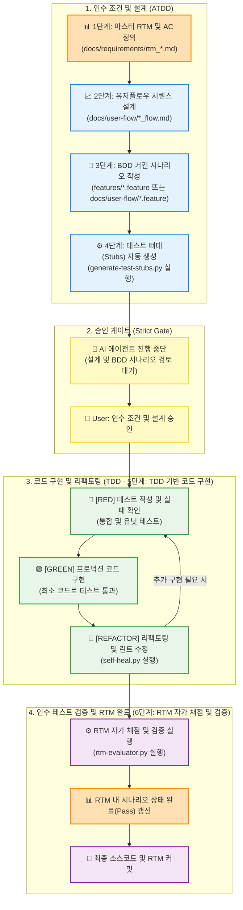

# 🔄 ATDD-TDD 개발 프로세스 흐름도 (BDD에서 ATDD로의 전환)

이 문서는 기존의 BDD 워크플로우를 **ATDD (인수 테스트 주도 개발)** 관점으로 재정의한 개발 흐름도입니다. 추가적인 AI/LLM 자동화 파이프라인이나 외부 도구 없이, 마스터 RTM과 기존 검증 도구(`rtm-evaluator.py`)를 활용하여 인수 조건 중심의 개발을 수행합니다.

---

### 💡 핵심 핵심 변화 (BDD ➔ ATDD):
1. **인수 조건(RTM)이 설계의 중심**: 단순히 Given-When-Then 행동을 묘사하는 것을 넘어, **RTM에 정의된 시나리오와 인수 조건(Acceptance Criteria)**이 개발을 주도(Driven)합니다.
2. **테스트 뼈대(Stubs)와 매핑**: BDD 시나리오를 바탕으로 생성된 테스트 코드(`.test.tsx`, `.spec.ts`, `_test.py`)가 RTM의 특정 인수 조건을 실제로 검증하는 증거(Evidence)로 연결됩니다.
3. **물리적 검증 자동화**: `rtm-evaluator.py`는 RTM 문서에 링크된 테스트 파일들이 실제로 존재하고 패스하는지 스캔하여 RTM 채점표를 완료(`Pass`) 처리합니다.
