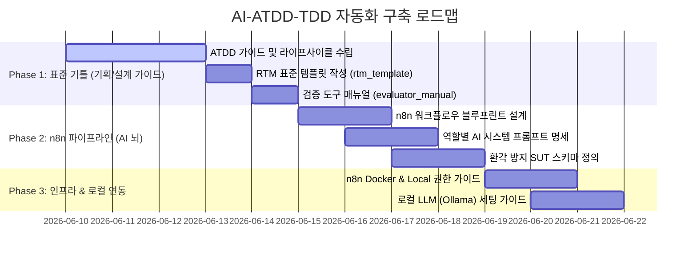

# 🗺️ AI-ATDD-TDD 자동화 시스템 구축 마일스톤 계획서

이 문서는 복잡하게 얽혀 있는 ATDD/TDD 자동화 파이프라인 개발 작업들을 세분화하고, 무엇부터 시작해야 하는지 로드맵을 단순화하여 제시합니다.

---

## 📌 현재 상황 진단 (Roadmap Status)

현재 `docs/atdd_automation_roadmap.md` 기준, 개념 설계 및 흐름도 구성은 완료되었으나 **표준 템플릿, n8n 인프라, LLM 프롬프트 설계** 등 실제 자동화를 위한 구현체와 규격 문서들이 많이 비어 있습니다.

---

## 🎯 단계별 세부 작업 계획 (Milestones)

### 🥇 Phase 1: ATDD 핵심 표준 규격 및 스크립트 가이드 (기틀 확립)
> **목적**: 시스템 설계의 중심인 RTM의 표준 구조를 확립하고, 기존 파이썬 유틸들의 작동 방식을 문서화하여 '로컬 ATDD 개발 기준선'을 잡습니다.

*   **1. `templates/rtm_template.md` 작성** [NEW]
    *   **세부 작업**: 에픽, 유저 스토리, 인수 조건(Happy/Boundary/Error), FE 컴포넌트, BE 라우터, DB 스키마, 테스트 스텁 경로 및 자가 채점표(Convention Self-Grading)가 포함된 마크다운 테이블 표준 템플릿 완성.
*   **2. `docs/evaluator_manual.md` 작성** [NEW]
    *   **세부 작업**: `rtm-evaluator.py` 및 `generate-test-stubs.py` 스크립트가 BDD 시나리오로부터 테스트 뼈대를 만드는 법, RTM 매핑 검증 감사(Audit)를 돌리는 방법, CLI 명령어 사용 예시 문서화.
*   **3. 스크립트 기능 점검**
    *   **세부 작업**: 실제로 가짜 `.feature`와 `rtm` 문서를 만들고, 스크립트가 올바르게 스텁을 만들고 자가 채점하는지 점검.

### 🥈 Phase 2: n8n 워크플로우 & AI 프롬프트 설계 (AI 파이프라인)
> **목적**: 기획안(Text)을 받아 RTM, 유저플로우, BDD 시나리오를 만들고 코드를 짜서 테스트를 통과시키는 'AI의 뇌와 신경망'을 설계합니다.

*   **4. `docs/n8n/agent_prompts.md` 작성** [NEW]
    *   **세부 작업**:
        *   RTM 생성 에이전트 (비정형 요구사항 ➡️ 표준 RTM 변환)
        *   UserFlow/BDD 생성 에이전트 (RTM ➡️ Mermaid + Gherkin 변환)
        *   TDD 구현 에이전트 (스텁 + SUT 명세 ➡️ 프로덕션 코드)
        *   Self-Healing 에이전트 (컴파일/런타임 에러 ➡️ 패치)
*   **5. `docs/n8n/sut_spec_schema.md` 작성** [NEW]
    *   **세부 작업**: AI의 환각을 방지하고 입출력 타입을 엄격하게 격리 검증하기 위한 SUT(System Under Test) 명세 스키마(JSON Schema) 작성 가이드.
*   **6. `docs/n8n/n8n_workflow_blueprint.md` 작성** [NEW]
    *   **세부 작업**: Git Webhook ➡️ RTM 감지 ➡️ LLM 에이전트 호출 ➡️ Docker 내 테스트 실행 ➡️ GitHub PR 발송까지의 전체 n8n 노드 흐름 설계도.

### 🥉 Phase 3: 로컬 인프라 및 개발 환경 구축
> **목적**: n8n이 로컬 머신에서 자유롭고 안전하게 코드를 수정하고 Docker에서 테스트를 돌릴 수 있도록 인프라 및 로컬 LLM을 셋업합니다.

*   **7. `docs/n8n/n8n_infra_guide.md` 작성** [NEW]
    *   **세부 작업**: n8n 컨테이너가 호스트 파일시스템에 접근할 수 있게 볼륨 바인딩을 하는 법, 안전한 샌드박스 Docker 컨테이너 생성 가이드.
*   **8. `docs/local_llm_setup.md` 작성** [NEW]
    *   **세부 작업**: 로컬 개발 비용을 극적으로 낮추기 위한 Ollama/vLLM 및 Qwen2.5-Coder 세팅 가이드.
*   **9. `github_issue_templates` 연동** [NEW]
    *   **세부 작업**: n8n 파이프라인에서 자동 발행할 GitHub Issue/PR 마크다운 템플릿 작성.

---

## 🛠️ 추천 액션 플랜 (What to do next?)

복잡함을 풀기 위해 **오늘 즉시 시작할 수 있는 추천 순서**입니다.

1.  **[1단계: 기틀 다지기] `templates/rtm_template.md` 생성**
    *   RTM이 어떻게 작성되어야 하는지 명확한 템플릿(표 형태)을 먼저 작성하여 기준을 잡습니다.
2.  **[2단계: 스크립트 매뉴얼] `docs/evaluator_manual.md` 작성**
    *   기존에 구현된 파이썬 스크립트들이 이 템플릿을 가지고 어떻게 테스트 스텁을 만들고 자가 채점하는지 프로세스를 글로 정리해 봅니다. 이 과정에서 스크립트 로직의 허점도 점검할 수 있습니다.
3.  **[심화 의견 조율] `/grill-me` 실행**
    *   만약 이 자동화 시스템의 세부적인 기능 설계나 n8n 구조에 대해 저와 의견 조율이 필요하다면, 채팅창에 `/grill-me`를 입력해 주세요. 인터랙티브한 인터뷰 형태로 생각을 쉽게 정리해 드리겠습니다.
