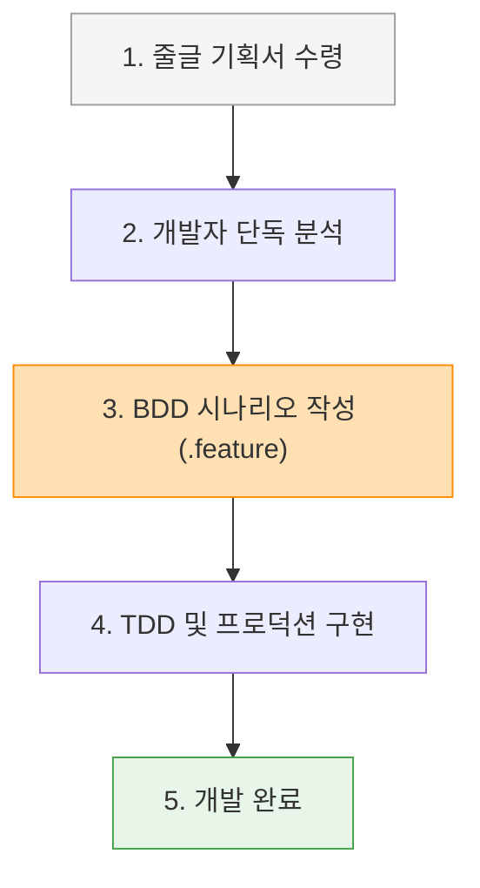
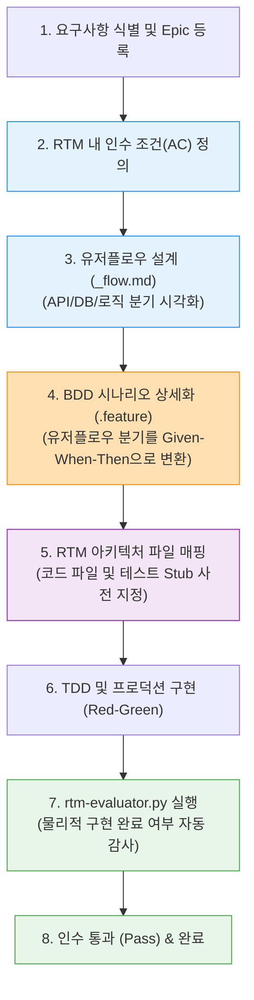
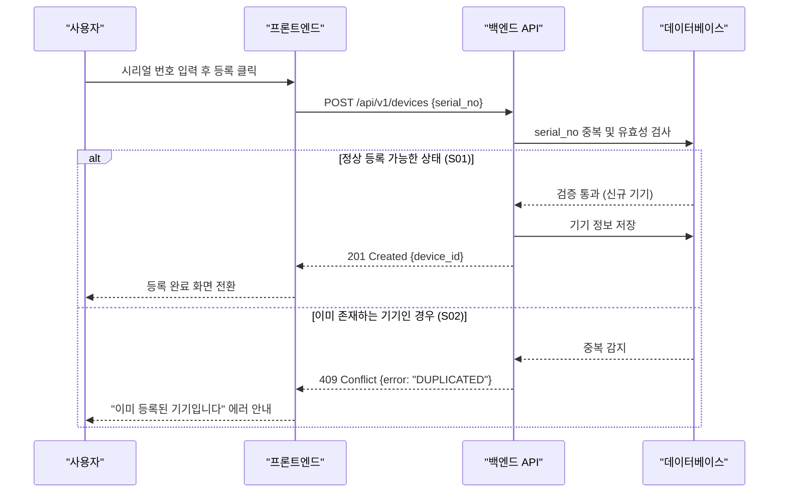

# BDD vs ATDD 시나리오 작업 프로세스 비교

이 문서는 시나리오(Given-When-Then)를 활용한 개발 방식에서 **BDD(행동 주도 개발)**와 **ATDD(인수 테스트 주도 개발)**가 실제 작업 프로세스(Workflow) 관점에서 어떻게 다른지 상세히 비교 설명합니다.

---

## 1. 개요: 왜 두 방식의 차이를 이해해야 하는가?

자연어 문법인 **Given-When-Then (거킨 문법)**을 쓴다고 해서 모두 ATDD를 하고 있는 것은 아닙니다. 
*   **BDD**는 시나리오를 통해 시스템의 **동작(Behavior)을 올바르게 구현**하는 데 집중하는 **코딩 방식**입니다.
*   **ATDD**는 시나리오를 통해 비즈니스 **요구사항(Acceptance Criteria)이 100% 충족되었는지 추적**하는 **개발 라이프사이클이자 통제 시스템**입니다.

이 차이는 개발자가 요구사항을 분석하고, 시나리오를 도출하며, 코드를 구현하고 검증하는 **전체 흐름(Process)**에서 극명하게 나타납니다.

---

## 2. 작업 프로세스(Workflow) 비교

### ❌ 일반 BDD 시나리오 작업 흐름 (개발자 중심의 사후 테스트)

일반적인 BDD는 기획서가 나온 후, 개발자가 코딩의 정밀도를 높이거나 테스트 코드를 자연어로 쉽게 쓰기 위해 독단적으로 시나리오를 작성하는 흐름을 가집니다.



*   **한계점**:
    1.  **기획 누락 불가피**: 기획서 내용 중 개발자가 빠뜨리거나 오해한 세부 사양은 BDD 시나리오 도출 단계에서부터 영원히 누락됩니다.
    2.  **구조 설계의 무 정합성**: 화면 구성이나 단일 성공 흐름 위주로 시나리오가 짜이기 때문에, 백엔드 API와의 스펙 불일치나 DB 트랜잭션 등 시스템 내부 예외 상황이 설계 단계에서 식별되지 못합니다.
    3.  **검증되지 않는 정합성**: BDD 테스트가 다 통과(`Pass`)해도, 이것이 실제 비즈니스 기획 조건 전부를 완수했음을 증명할 객관적인 연결 고리(매트릭스)가 없습니다.

---

### 🟢 ATDD 시나리오 작업 흐름 (팀 전체의 선제적 설계 계약)

ATDD는 기획 조건(AC)을 시스템 구조와 매핑하여 **인수 합격선(Gate)**을 먼저 구축하고, 이 게이트를 통과하기 위한 수단으로 유저플로우와 시나리오를 도출하는 흐름을 가집니다.



*   **핵심 차별점**:
    1.  **선(先) 설계, 후(後) 문장화**: 줄글 기획서에서 바로 Given-When-Then 문장을 뽑지 않습니다. **유저플로우 시퀀스 다이어그램**을 그리며 `FE ↔ BE ↔ DB` 간 통신 흐름과 예외 분기점(alt/else)을 시각적으로 먼저 확정한 뒤, 그 경로들을 그대로 시나리오로 변환합니다.
    2.  **RTM을 통한 정합성 강제**: 시나리오 도출 단계에서 해당 시나리오를 구현할 소스코드 파일 경로와 테스트 파일 경로를 **RTM 매핑 테이블**에 미리 명시해 둡니다. 이는 설계 단계에서 기술적 누락이 없는지 아키텍처적으로 교차 검증해 줍니다.
    3.  **물리적 자동 감사**: 개발 완료 후 사람이 대충 눈으로 확인하는 대신, 자동화 스크립트(`rtm-evaluator.py`)가 RTM의 물리 증거(소스 파일 및 테스트 실행 결과)를 실시간 스캔하여 요구사항 충족률을 보장합니다.

---

## 3. 시나리오 상세 비교 (동일 기능 기준)

**"사용자 기기 등록 기능"**을 구현할 때, 두 방식이 도출하는 시나리오 결과물과 매핑 데이터를 비교해 보면 차이를 더 명확히 이해할 수 있습니다.

### 1) 일반 BDD의 결과물
개발자는 화면 동작에 집중하여 아래와 같이 단일 `.feature` 파일만 작성합니다.

```gherkin
# device.feature (BDD 방식)
Feature: 기기 등록
  Scenario: 기기를 정상 등록한다
    Given 사용자가 기기 등록 페이지에 진입한 상태
    When 기기 시리얼 번호 "DEV-100"을 입력하고 "등록" 버튼을 누른다
    Then 화면에 "기기가 성공적으로 등록되었습니다" 메시지가 표시된다
```
*   **문제점**: 
    - UI 요소인 "버튼을 누른다", "화면에 표시된다"에 의존하여 프론트엔드 변경 시 깨지기 쉬운 부실한 시나리오입니다.
    - 기기가 이미 등록되어 있거나, 시리얼 번호가 비정상 포맷일 때 백엔드 API가 어떻게 대응해야 하는지에 대한 **예외 처리가 완전히 누락**되어 있습니다.

---

### 2) ATDD의 결과물
ATDD에서는 비즈니스 요구사항(RTM AC)을 완수하기 위해 **유저플로우 시퀀스 설계**를 선행하고, 각 분기를 아우르는 **시나리오 패키지(성공/경계/예외)**와 **추적성 매핑**을 동시에 생성합니다.

#### ① [선행] 유저플로우 설계 (`device_flow.md`)


#### ② [결과] RTM 설계 및 아키텍처 매핑 테이블
유저플로우에서 식별된 분기(`S01`, `S02`)를 RTM 매트릭스에 등록하고, 실제 구현해야 할 아키텍처 소스코드 파일과 1:1로 매핑해 둡니다.

| 시나리오 ID | 시나리오명 | 인수 조건 (Acceptance Criteria) | 매핑 소스코드 파일 | 매핑 테스트 파일 |
| :--- | :--- | :--- | :--- | :--- |
| **S01** | 신규 기기 등록 성공 | 중복되지 않은 시리얼 번호 요청 시 DB에 저장하고 201 Created를 반환한다. | [device_router.py](file:///src/api/device_router.py)<br>[device_service.py](file:///src/domain/device_service.py) | [test_device_success.py](file:///tests/domain/test_device_success.py) |
| **S02** | 기기 중복 등록 차단 | 이미 등록된 시리얼 번호 요청 시 DB 저장을 차단하고 409 Conflict를 반환한다. | [device_router.py](file:///src/api/device_router.py)<br>[device_exception.py](file:///src/domain/device_exception.py) | [test_device_fail.py](file:///tests/domain/test_device_fail.py) |

#### ③ [결과] BDD 시나리오 (`device.feature`)
유저플로우 분기와 RTM 인수 조건을 완수하기 위한 Given-When-Then 문장을 도메인 상태 중심으로 도출합니다. (UI 의존도 제거)

```gherkin
# device.feature (ATDD 방식)
Feature: 기기 등록 및 중복 검증 기능

  Background:
    Given DB에 시리얼 번호가 "DEV-999"인 기기가 이미 등록되어 있는 상태

  Scenario: S01. 중복되지 않은 신규 기기를 정상적으로 등록한다 (정상 흐름)
    When 사용자가 신규 시리얼 번호 "DEV-100"으로 기기 등록을 요청할 때
    Then 시스템은 기기 생성 성공 상태(201 Created)를 반환해야 한다
    And DB에 "DEV-100" 기기가 영구 저장되어야 한다

  Scenario: S02. 이미 존재하는 시리얼 번호 요청 시 등록을 차단한다 (예외 흐름)
    When 사용자가 중복된 시리얼 번호 "DEV-999"로 기기 등록을 요청할 때
    Then 시스템은 중복 충돌 상태(409 Conflict)를 반환해야 한다
    And DB에 추가적인 기기 정보가 저장되지 않아야 한다
```

---

## 4. 핵심 요약

| 비교 항목 | 일반 BDD 시나리오 작업 | ATDD 시나리오 작업 (우리 프로젝트) |
| :--- | :--- | :--- |
| **작성 시점** | 기획 분석 후 코딩 직전 | **기획 접수 직후, 설계 단계 전체** |
| **작업 흐름** | `기획 ➡️ BDD 작성 ➡️ 코딩` | **`기획 ➡️ 유저플로우 설계 ➡️ BDD 작성 ➡️ RTM 파일 매핑 ➡️ 코딩 ➡️ 자동 감사`** |
| **완성도 보장** | 보장 장치 없음 (개발자 역량에 의존) | **유저플로우 분기(alt/else) 시각화를 통해 시나리오 누락 완전 방지** |
| **품질 확인** | 테스트 실행 결과 창 (`Pass`/`Fail`) | **`rtm-evaluator.py`를 통한 비즈니스 기획 대비 소스코드 매핑 충족률 확인** |
| **UI 변경 대응** | UI 세부 동작 기재로 변경 시 시나리오 붕괴 | 도메인 상태 기재로 UI가 앱/웹/API로 바뀌어도 시나리오 유지 |
